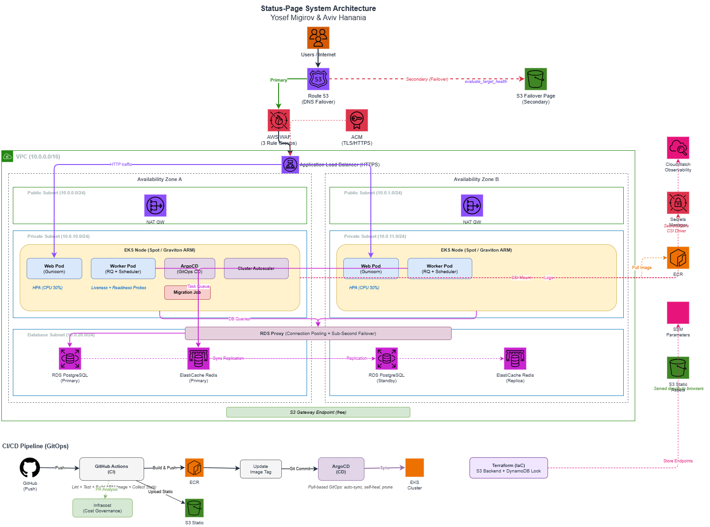

# Status-Page Infrastructure

Production-grade AWS infrastructure for the [Status-Page](https://github.com/avivhananiya/status-page-aviv-yosef-app) application. Built for high availability, security, and cost efficiency.

**Yosef Migirov & Aviv Hanania**

## Architecture

Multi-AZ deployment on AWS EKS with automated failover, edge security, and FinOps cost optimization.



**Key design decisions:**
- **Graviton (ARM)** processors across compute and data layers for 20% cost reduction
- **Spot Instances** with diversified types (t4g.large, m6g.large) for ~50-60% compute savings
- **RDS Proxy** for sub-second database failover and connection pooling
- **GitOps** with GitHub Actions (CI) and Argo CD (CD) for pull-based deployments
- **DNS Failover** to a static S3 page ensures the status page is reachable even during full outages

## Repository Structure

```
terraform/          AWS infrastructure (VPC, EKS, RDS, ElastiCache, WAF, Route 53)
k8s/                Helm chart (Deployments, Services, Ingress, HPA, Secrets)
argocd/             ArgoCD Application manifest (GitOps CD)
.github/workflows/  CI pipelines (Terraform validation, Infracost cost estimation)
docs/               Architecture documentation and cost estimation
```

The application source code lives in a [separate repository](https://github.com/avivhananiya/status-page-aviv-yosef-app).

## Tech Stack

| Layer | Technology |
|---|---|
| Orchestration | Amazon EKS (Kubernetes 1.35) |
| Compute | EC2 Spot Instances (Graviton/ARM) |
| Database | RDS PostgreSQL 15 Multi-AZ + RDS Proxy |
| Cache & Queue | ElastiCache Redis Multi-AZ |
| Networking | VPC, ALB, Dual NAT Gateways, S3 Gateway Endpoint |
| Security | AWS WAF, ACM (TLS), Secrets Manager + CSI Driver, SSM Session Manager |
| CI/CD | GitHub Actions + Argo CD (GitOps) |
| IaC | Terraform (S3 backend + DynamoDB locking) |
| Observability | CloudWatch Agent (DaemonSet with FinOps log filtering) |
| Cost Governance | Infracost (Terraform PR cost estimation) |

## Prerequisites

- AWS CLI configured with appropriate credentials
- Terraform >= 1.3.0
- kubectl
- Helm 3

## Getting Started

**1. Bootstrap the Terraform backend:**

```bash
cd terraform
./bootstrap-backend.sh
```

**2. Initialize and apply Terraform:**

```bash
terraform init
terraform plan
terraform apply
```

**3. Configure kubectl:**

```bash
aws eks update-kubeconfig --name yosef-aviv-status-page-prod --region us-east-1
```

**4. Deploy via ArgoCD:**

```bash
kubectl apply -f argocd/application.yaml
```

## Cost

**$390.28/month** for continuous 24/7 operation of the full Multi-AZ, high-availability architecture.

| Layer | Full 24/7 (730hr) | With College Scheduling (~260hr) |
|---|---|---|
| Compute (EKS + Spot Nodes) | $131.93 | $98.86 |
| Data (RDS + RDS Proxy + Redis) | $150.93 | $90.30 |
| Networking (NAT GWs + ALB) | $85.52 | $85.52 |
| Security & Management | $21.90 | $21.90 |
| **Total** | **$390.28** | **$296.58** |

> The college AWS environment enforces a resource-scheduling policy that shuts down compute outside business hours, bringing effective cost to ~$296.58/month.

See [docs/AWS Cost Estimation.md](docs/AWS%20Cost%20Estimation.md) for the full breakdown and [docs/System Architecture.md](docs/System%20Architecture.md) for architectural decisions and trade-offs.

## Documentation

- [System Architecture](docs/System%20Architecture.md) -- design, layers, and trade-off rationale
- [AWS Cost Estimation](docs/AWS%20Cost%20Estimation.md) -- line-item pricing and FinOps strategies
